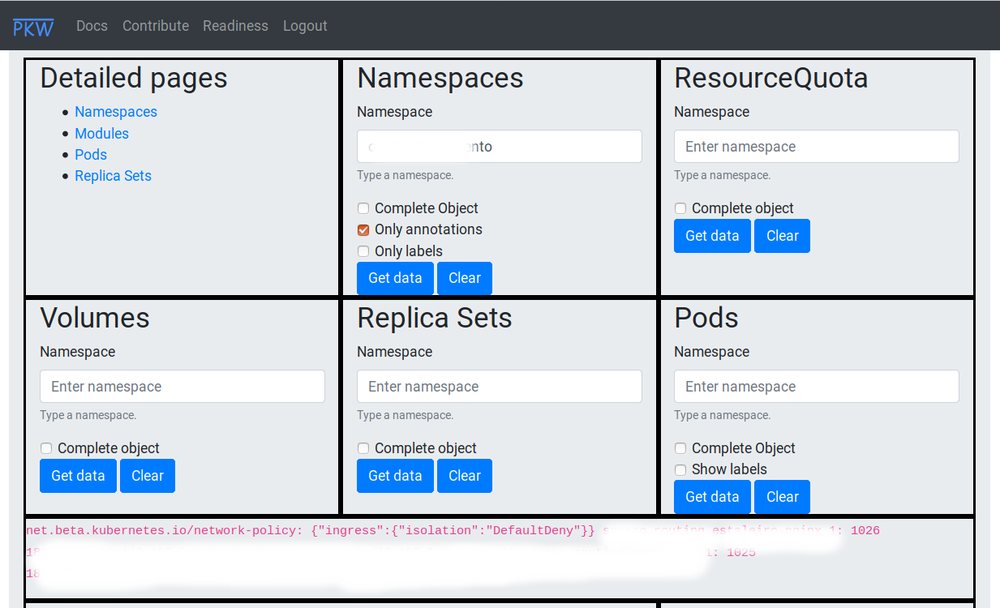

# PHP Kubectl Web Administrator

## Requirements

1. Kubeclt 1.13 installed
2. PHP 7.2+ installed
3. A Web server installed with PHP support (Apache is recommended)

## Installation

1. Download source code
2. Make directory *public* as webroot
3. Start your webserver

Observation: *url rewrite* must be enabled in web server configuration

## Screenshots

### Login

Current version of pkw uses an idea of Tomcat for authentication. Enabled users are defined in file `credentials.php` inside folder `data/security`. Contributions for authentication adapters for database, ldap and other are welcome.

### Main page

Current version of pkw allows to see data from namespaces, resource quotas and pods in a web console.

Each button `Get data` outputs in same footer section of page.     
Each button `Clear` remove data from that section.
Image below shows a obfuscated result of a namespace query.
 

 
 
 